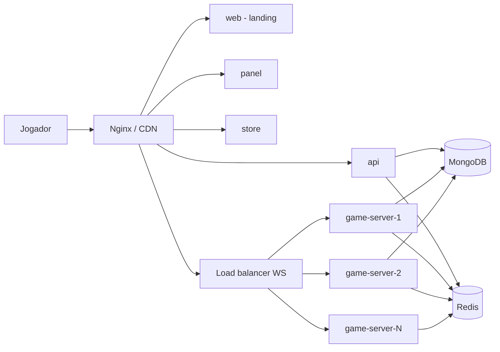

# Age of AI — Arquitetura Escalável

Documento de referência para a estrutura multi-app do projeto.

## Objetivo

Suportar muitos jogadores e muitas partidas em paralelo, com serviços que se podem **duplicar** (especialmente o Game Server) sem reescrever o produto.

## Visão geral

```text
age-of-ai/
├── apps/
│   ├── web/              # Site de apresentação (landing)
│   ├── panel/            # Painel do jogador (conta, amigos, inventário, lobby)
│   ├── store/            # Loja (skins, packs) — fase posterior
│   ├── api/              # Auth, users, matchmaking metadata, pagamentos
│   └── game-server/      # Nó de jogo (WS + simulação) — escalável N vezes
├── packages/
│   ├── shared/           # tipos, protocolo WS, constantes
│   └── config/           # schemas de env (opcional)
├── infra/
│   ├── docker-compose.yml
│   ├── nginx/
│   └── k8s/              # mais tarde
└── docs/
    └── ARCHITECTURE.md   # este ficheiro
```



## Papel de cada peça

| App | Faz | Não faz |
|-----|-----|---------|
| **web** | Marketing, Discord, CTA | Auth pesada, gameplay |
| **panel** | Login, perfil, criar/entrar match, histórico | Simular o jogo |
| **store** | Catálogo, compras | Lógica RTS |
| **api** | JWT, users, matchmaking, faturação, stats | Tick do mundo |
| **game-server** | Rooms, tick, comandos, sync | HTML, OAuth UI |

**Regras:**

- A **API** é a fonte de verdade da **conta**.
- O **Game Server** é a fonte de verdade da **partida**.
- O cliente **não decide** regras de jogo (servidor autoritativo).

## Como escalar partidas

1. Jogador pede match à **API** (`POST /matches`).
2. API escolhe um **game-server** com capacidade (Redis: `server:{id}:load`).
3. API devolve `wss://gs-N.../match/ABC123` + token curto de entrada.
4. Cliente liga **só** a esse nó.
5. Cada nó aguenta N rooms; quando satura, sobe outro container **igual**.

Duplicar game-server = copiar a mesma imagem Docker. Sem lógica especial por nó.

## Stack prática

- **Monorepo**: `pnpm` workspaces
- **API**: Express + MongoDB
- **Game Server**: Node + `ws`
- **Web (landing)**: **Next.js 16** (App Router) em `apps/web`
- **Panel**: Express static (menu + jogo)
- **Redis**: matchmaking, sessões, presença, pub/sub entre nós
- **MongoDB**: users, inventário, snapshots de partida
- **Nginx**: `/` → web, `/app` → panel, `/api` → api, `/gs/*` → game nodes
- **Docker Compose** agora; Kubernetes só quando necessário

## Ordem de migração

1. Extrair **api** (auth + stats + matches metadata)
2. Extrair **game-server** (rooms + WS)
3. **web** = landing
4. **panel** = menu + criar/entrar partida + cliente de jogo
5. Redis + registry de nós
6. **store** quando houver monetização
7. Sync por **deltas** (em vez de full state a 20 Hz)

## O que evitar

- Um microserviço por feature (`trade-service`, `combat-service`) cedo demais
- Site + simulação no mesmo processo Node
- Mundo global único (usar rooms/matches)
- Broadcast de estado completo a 20 Hz sem deltas
- Secrets e passwords default em produção

## Portas (dev)

| Serviço | Porta |
|---------|-------|
| web | 8080 (ou nginx :80) |
| panel | 8081 |
| api | 3001 |
| game-server | 3002 (WS), 3003 para 2.º nó |
| mongodb | 27017 |
| redis | 6379 |

## Redis registry + matchmaking (multi-node)

Cada `game-server` regista heartbeat no Redis (`aoai:gs:nodes` + `aoai:gs:node:{id}`, TTL 15s):

- `nodeId`, `wsUrl`, `onlinePlayers`, `matches`, `maxPlayers`

A API escolhe o nó com menos load (`pickLeastLoaded`) e expõe:

| Endpoint | Auth | Função |
|----------|------|--------|
| `GET /api/game-servers` | opcional | Lista nós vivos |
| `GET /api/game-server` | opcional | Melhor nó (ou fallback `GAME_SERVER_WS_URL`) |
| `POST /api/matches` | JWT | Matchmaking → `{ wsUrl, action, joinPayload }` |
| `GET /api/stats` | — | Agrega players/matches de todos os nós |

Fluxo cliente:

1. `POST /api/matches` (ou `GET /api/game-server`)
2. Abrir WebSocket em `wsUrl`
3. Enviar `join_game` / `create_match` / `join_match` conforme `action`

O **panel** (`apps/panel`) faz este fluxo em `js/matchmaking.js` + `main.js` ao abrir `/game`.

Dev com 2 nós:

```bash
# infra
docker compose up -d redis mongodb

# terminais separados
pnpm dev:api
pnpm dev:game                    # :3002, GAME_NODE_ID=gs-1
pnpm dev:game:2                  # :3003, GAME_NODE_ID=gs-2
```

Se Redis estiver offline, a API cai no fallback single-node (`GAME_SERVER_WS_URL`).

## Gateway Nginx (um domínio)

```bash
pnpm infra:up                    # mongo + redis + nginx :80
pnpm dev:web                     # :8080
pnpm dev:panel                   # :8081
pnpm dev:api                     # :3001
pnpm dev:gateway:game            # regista ws://localhost/gs/gs-1
# opcional: pnpm dev:gateway:game:2
```

| Path | Destino |
|------|---------|
| `http://localhost/` | web (landing) |
| `http://localhost/login` | auth (login) |
| `http://localhost/register` | auth (registo) |
| `http://localhost/auth/success` | OAuth callback UI |
| `http://localhost/app/menu` | panel (jogo) |
| `http://localhost/api/` | API |
| `ws://localhost/gs/gs-1` | game-server 1 |
| `ws://localhost/gs/gs-2` | game-server 2 |

Auth fica na **raiz** (como na maioria dos produtos). O jogo fica sob `/app/*`.

## Princípio operacional

Cada `game-server` é **stateless a nível de infra**: estado da partida em memória + snapshot periódico no Mongo. Se o nó cair, a API pode reatribuir ou restaurar snapshot noutro nó (fase avançada).
